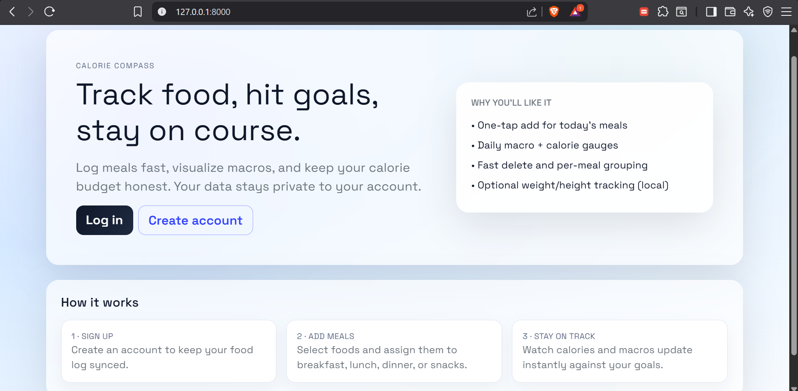
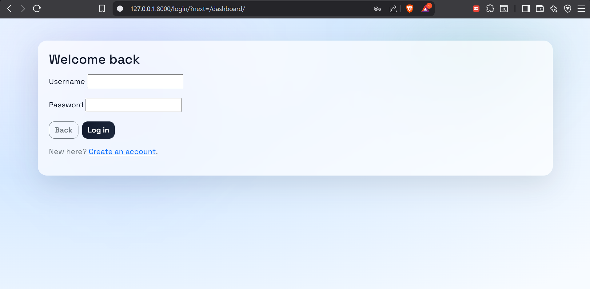
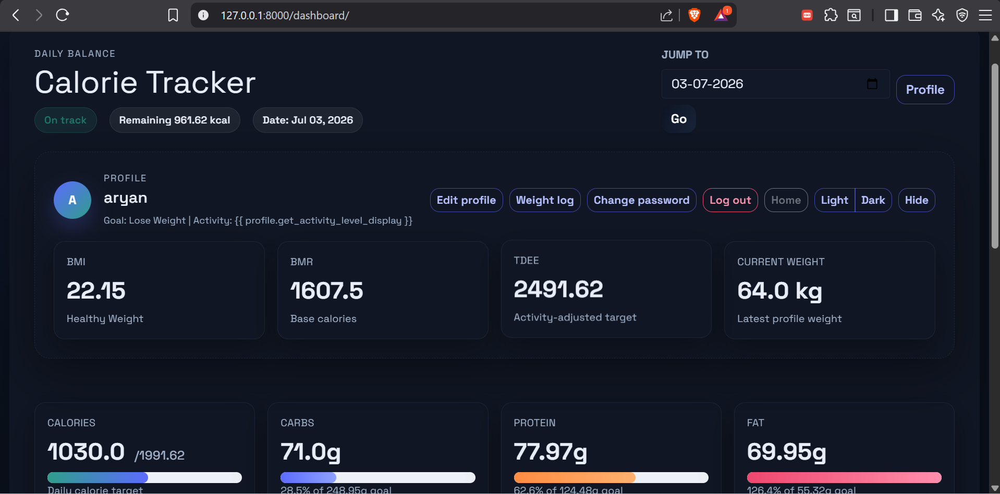
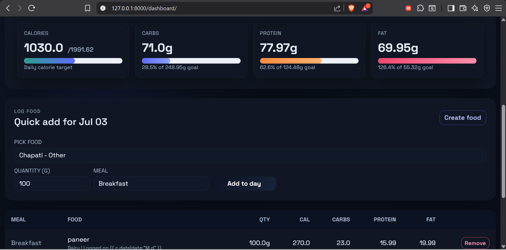
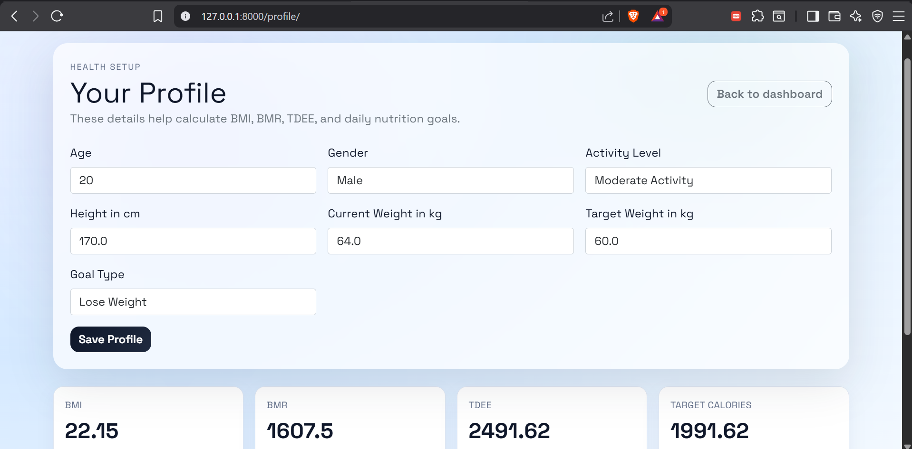
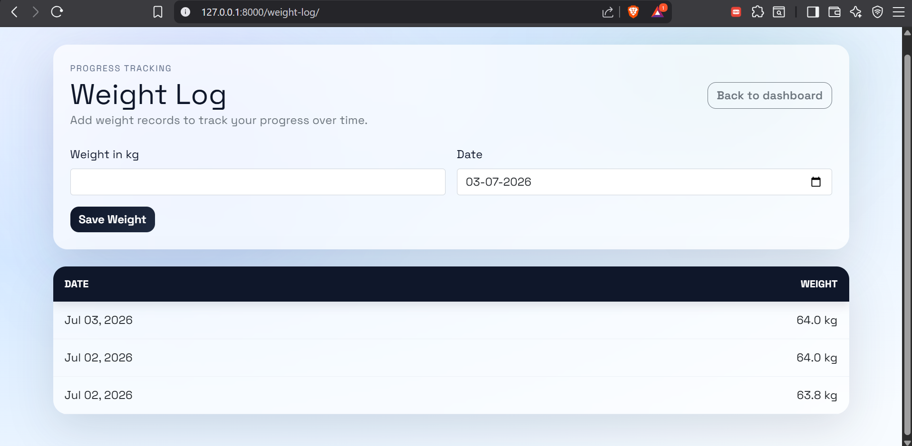
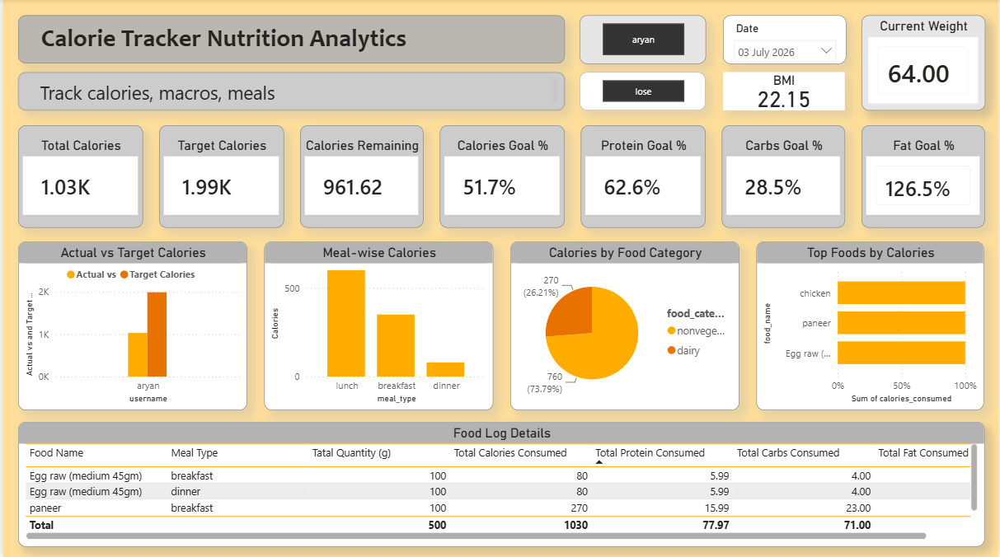
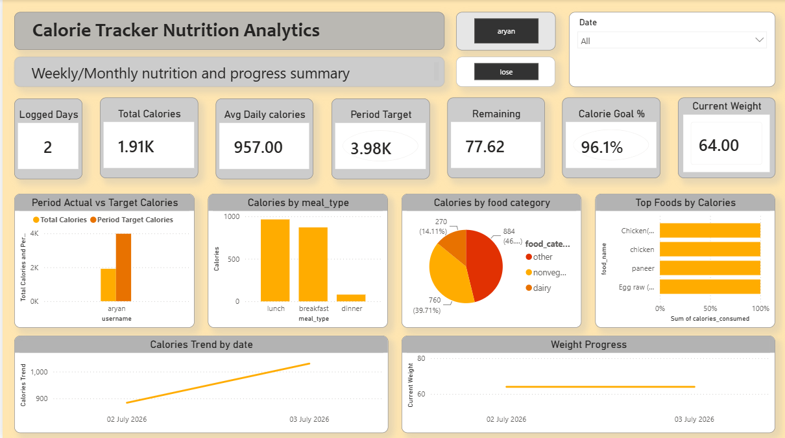

# CalorieTracker BI Dashboard

A full-stack calorie tracking and nutrition analytics project built with **Django**, **Python**, **SQL**, and **Power BI**.

This project allows users to track food intake, calorie consumption, macronutrients, health profile details, and weight progress through a Django web application. The collected data is exported using a custom Django management command and analyzed in Power BI through interactive Daily and Period analytics dashboards.

---

## Project Overview

CalorieTracker is designed as an end-to-end nutrition tracking and analytics system.

The Django web app is used for operational data entry and user tracking, while Power BI is used as the analytics and reporting layer.

```text
Django Web App
        ↓
SQLite Database
        ↓
Python Export Command
        ↓
Clean CSV Files
        ↓
Power BI Dashboard
```

This structure follows a real-world pattern where an application collects data and a BI dashboard is used for deeper reporting and decision-making.

---

## Key Features

### Django Web Application

- User registration and login
- Food item creation with calories and macronutrients
- Food category management
- Food consumption logging with quantity in grams
- Meal type tracking such as breakfast, lunch, dinner, and snacks
- User health profile management
- BMI, BMR, TDEE, and personalized target calorie calculation
- Weight log tracking
- Quantity-based calorie and macro calculation
- Clean local SQLite setup for development

### Power BI Analytics

- Clean CSV export from Django database
- User-specific filtered export using username
- Daily nutrition analytics dashboard
- Period-based nutrition analytics dashboard
- Calories vs target tracking
- Macro goal percentage tracking
- Meal-wise calorie analysis
- Food category calorie distribution
- Top foods by calorie contribution
- Current weight tracking
- Weight progress analysis
- Date table and relationship-based filtering
- DAX measures for daily and period-level insights

---

## Tech Stack

| Area            | Technology                              |
| --------------- | --------------------------------------- |
| Backend         | Django, Python                          |
| Database        | SQLite                                  |
| Frontend        | HTML, CSS, Bootstrap                    |
| Data Export     | Python CSV, Django Management Command   |
| Analytics       | Power BI                                |
| BI Modeling     | Relationships, Date Table, DAX Measures |
| Version Control | Git, GitHub                             |

---

## Screenshots

### Landing Page



### Login Page



### Django Dashboard





### Profile Page



### Weight Log Page



### Power BI Daily View



### Power BI Period View



---

## Power BI Dashboard Views

### Daily View

The Daily View is designed for one selected date.

It helps answer:

- What did the user eat on a specific day?
- How many calories were consumed?
- Was the daily calorie target achieved?
- Which meals contributed the most calories?
- Which food categories contributed the most?
- Which foods had the highest calorie contribution?
- What was the macro progress for that day?

The Daily View is useful for day-level tracking and food log review.

### Period View

The Period View is designed for multiple selected dates.

It helps answer:

- How many days were logged?
- What was the total calorie intake over the selected period?
- What was the average daily calorie intake?
- How did actual calories compare with period target calories?
- Which foods contributed most over the period?
- Which meal types contributed most calories?
- Which food categories dominated the selected period?
- How did weight change over time?

The Period View is useful for weekly, monthly, or custom date-range analysis.

---

## Data Export Pipeline

A custom Django management command exports clean CSV files for Power BI.

Basic export command:

```bash
python manage.py export_powerbi_data
```

Filtered export for a specific user:

```bash
python manage.py export_powerbi_data --username aryan
```

This generates CSV files inside:

```text
mysite/powerbi_exports/
```

Exported CSV files:

```text
foods.csv
consumption_logs.csv
user_profiles.csv
weight_logs.csv
daily_nutrition_summary.csv
```

The exported CSV files are generated data files and are ignored from Git.

---

## Why CSV Export Was Used

Power BI reads the cleaned CSV files generated from the Django database.

Current flow:

```text
User adds data in Django
        ↓
Data is stored in SQLite
        ↓
Export command creates CSV files
        ↓
Power BI refreshes CSV data
        ↓
Dashboard updates
```

In the current version, Power BI does not update automatically after every user action. After new data is added, the export command is run again and Power BI is refreshed.

In a production version, this can be improved by connecting Power BI directly to PostgreSQL or by using scheduled refresh.

---

## Power BI Data Model

The Power BI report uses multiple connected tables:

```text
foods
consumption_logs
user_profiles
weight_logs
daily_nutrition_summary
DateTable
```

Main relationships:

```text
consumption_logs[food_id] → foods[food_id]

consumption_logs[user_id] → user_profiles[user_id]

daily_nutrition_summary[user_id] → user_profiles[user_id]

weight_logs[user_id] → user_profiles[user_id]

DateTable[Date] → daily_nutrition_summary[date]

DateTable[Date] → consumption_logs[date]

DateTable[Date] → weight_logs[date]
```

The DateTable is used as the common date filter so that one date slicer can control nutrition logs, daily summaries, and weight logs.

---

## Important DAX Measures

### Total Calories

```DAX
Total Calories = SUM(daily_nutrition_summary[total_calories])
```

### Total Protein

```DAX
Total Protein = SUM(daily_nutrition_summary[total_protein])
```

### Total Carbs

```DAX
Total Carbs = SUM(daily_nutrition_summary[total_carbs])
```

### Total Fat

```DAX
Total Fat = SUM(daily_nutrition_summary[total_fat])
```

### Target Calories

```DAX
Target Calories = MAX(user_profiles[target_calories])
```

### Target Protein

```DAX
Target Protein = MAX(user_profiles[target_protein])
```

### Target Carbs

```DAX
Target Carbs = MAX(user_profiles[target_carbs])
```

### Target Fat

```DAX
Target Fat = MAX(user_profiles[target_fat])
```

### Calories Remaining

```DAX
Calories Remaining = [Target Calories] - [Total Calories]
```

### Calories Goal %

```DAX
Calories Goal % = DIVIDE([Total Calories], [Target Calories], 0)
```

### Protein Goal %

```DAX
Protein Goal % = DIVIDE([Total Protein], [Target Protein], 0)
```

### Carbs Goal %

```DAX
Carbs Goal % = DIVIDE([Total Carbs], [Target Carbs], 0)
```

### Fat Goal %

```DAX
Fat Goal % = DIVIDE([Total Fat], [Target Fat], 0)
```

---

## Period View DAX Measures

### Logged Days

```DAX
Logged Days = DISTINCTCOUNT(daily_nutrition_summary[date])
```

### Average Daily Calories

```DAX
Average Daily Calories = DIVIDE([Total Calories], [Logged Days], 0)
```

### Period Target Calories

```DAX
Period Target Calories = [Target Calories] * [Logged Days]
```

### Period Calories Remaining

```DAX
Period Calories Remaining = [Period Target Calories] - [Total Calories]
```

### Period Calories Goal %

```DAX
Period Calories Goal % = DIVIDE([Total Calories], [Period Target Calories], 0)
```

---

## Current Weight Logic

The dashboard uses a custom Current Weight measure instead of simple average weight.

This is useful because weight is not logged every day. If there is no weight entry for a selected date, the dashboard uses the latest previous weight.

```DAX
Current Weight =
VAR CurrentDate =
    MAX(DateTable[Date])
VAR LastWeightDate =
    CALCULATE(
        MAX(weight_logs[date]),
        REMOVEFILTERS(DateTable),
        weight_logs[date] <= CurrentDate
    )
VAR LastWeightValue =
    CALCULATE(
        MAX(weight_logs[weight_kg]),
        REMOVEFILTERS(DateTable),
        weight_logs[date] = LastWeightDate
    )
RETURN
    COALESCE(
        LastWeightValue,
        MAX(user_profiles[current_weight_kg])
    )
```

This makes the weight card and weight progress chart more realistic.

---

## Dynamic Profile Display

The dashboard uses a dynamic display name measure instead of hardcoding a specific username.

```DAX
User Display Name =
VAR SelectedUser =
    COALESCE(MAX(user_profiles[username]), "User")
VAR CleanUser =
    SUBSTITUTE(SelectedUser, "_", " ")
RETURN
    UPPER(LEFT(CleanUser, 1)) &
    LOWER(MID(CleanUser, 2, LEN(CleanUser)))
```

This allows the profile card to update based on the available user data.

---

## Project Folder Structure

```text
calorieTracker/
│
├── mysite/
│   ├── myapp/
│   │   ├── management/
│   │   │   └── commands/
│   │   │       └── export_powerbi_data.py
│   │   ├── models.py
│   │   ├── views.py
│   │   ├── forms.py
│   │   └── templates/
│   │
│   ├── manage.py
│   └── db.sqlite3
│
├── powerbi/
│   └── CalorieTracker_PowerBI_Dashboard.pbix
│
├── screenshots/
│   ├── landing-page.png
│   ├── login-page.png
│   ├── django-dashboard-1.png
│   ├── django-dashboard-2.png
│   ├── profile-page.png
│   ├── weight-log.png
│   ├── powerbi-daily-view.png
│   └── powerbi-period-view.png
│
├── README.md
└── .gitignore
```

---

## How to Run Locally

### 1. Clone the repository

```bash
git clone https://github.com/aryann003/calorieTracker.git
cd calorieTracker
```

### 2. Go to Django project folder

```bash
cd mysite
```

### 3. Create a virtual environment

```bash
python -m venv venv
```

### 4. Activate virtual environment

For Windows PowerShell:

```bash
venv\Scripts\activate
```

### 5. Install dependencies

```bash
pip install -r requirements.txt
```

### 6. Run migrations

```bash
python manage.py migrate
```

### 7. Start development server

```bash
python manage.py runserver
```

Open in browser:

```text
http://127.0.0.1:8000/
```

---

## Power BI Refresh Workflow

When new data is added in the Django app, run:

```bash
python manage.py export_powerbi_data --username aryan
```

Then open Power BI Desktop and click:

```text
Home → Refresh
```

Finally save the `.pbix` file.

---

## Development Timeline

### Day 1

- Cleaned repository
- Configured local SQLite setup
- Added proper `.gitignore`
- Verified migrations and local server

### Day 2

- Upgraded models for analytics
- Added food categories
- Added quantity-based consumption fields
- Added profile and weight tracking models

### Day 3

- Added forms, views, templates
- Added profile page
- Added weight log page
- Updated dashboard calculations

### Day 4

- Added Power BI CSV export command
- Exported food, consumption, profile, weight, and daily summary data

### Day 5

- Imported CSV files into Power BI
- Created relationships
- Created first dashboard
- Added basic DAX measures

### Day 6

- Improved dashboard UI
- Added target, remaining, and goal percentage measures
- Added BMI, goal, and profile-related cards

### Day 6.5

- Added username filter to export command
- Cleaned mixed-user data issue
- Removed blank slicer issue
- Created Daily View and Period View
- Added period-based DAX measures
- Added Current Weight logic

### Day 7

- Added screenshots
- Updated README
- Prepared project for GitHub, resume, and interview explanation

---

## Resume Highlights

- Built a Django-based calorie tracking web application with authentication, food logging, profile management, and weight tracking.
- Designed quantity-based nutrition calculations for calories, protein, carbohydrates, and fat.
- Implemented BMI, BMR, TDEE, and personalized nutrition target calculations.
- Created a custom Django management command to export clean CSV datasets for Power BI.
- Built an interactive Power BI dashboard with separate Daily View and Period View analytics.
- Used Power BI relationships, Date Table, and DAX measures for target comparison, macro progress, period analytics, and weight tracking.
- Applied data cleaning by filtering exports for a specific user to remove mixed-user and blank slicer issues.
- Organized project with Git, GitHub, screenshots, README documentation, and a resume-ready architecture.

---

## Interview Explanation

This project is not only a calorie tracker website. It is an end-to-end nutrition tracking and analytics system.

The Django application handles user-facing operations like registration, food logging, profile management, and weight tracking. The data is stored in a database. A custom Django management command exports clean CSV files from the database. Power BI then uses those CSV files to create interactive dashboards.

The Power BI report contains two main views:

- Daily View for one-day nutrition analysis
- Period View for weekly or multi-day progress analysis

This separation makes the dashboard more logical because daily metrics and period metrics answer different questions.

---

## Future Improvements

- Add user-facing charts directly inside Django using Chart.js
- Connect Power BI directly to PostgreSQL instead of CSV exports
- Add scheduled export and Power BI refresh automation
- Add advanced nutrition insights and weekly reports
- Improve food category classification
- Add full-name export from Django user profile
- Add deployment with production database
- Add role-based admin analytics dashboard

---

## Project Status

Completed as a full-stack and business intelligence portfolio project.

Current version includes:

```text
Django web app
Clean CSV export pipeline
Power BI Daily View
Power BI Period View
DAX measures
GitHub-ready screenshots
Professional README
```

---

## Author

**Aryan Katiyar**

GitHub: [aryann003](https://github.com/aryann003)
